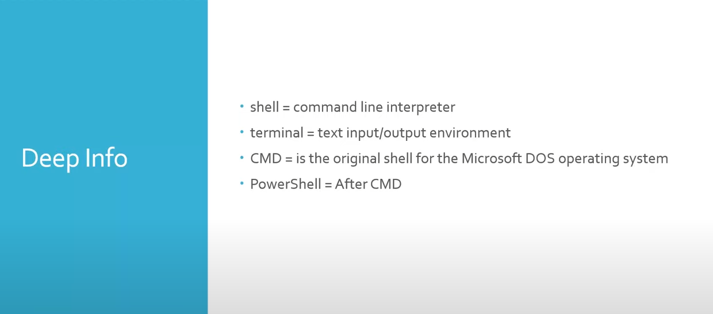

# Summary of Command line topics, commands & notes:

This repository contains a collection of topics, commands & notes to enhance understanding of Command line.

---

## Table of Contents

- [Sessions topics](#sessions-topics)
- [Documentary website (SS64)](#documentary-website-SS64)
- [How to use](#how-to-use)
- [Contributions](#contributions)
- [License](#license)

---

## Sessions topics

### Session-1: 
- **Purpose**: This image explains the meaning of Shell, PowerShell, Terminal & CMD.

  

### Session-3:
- **Purpose**: This session provides details and notes about working with directories and files using commands like (cd, ls, mkdir, explorer, clear & exit).

  

### Session-4: 
- **Purpose**: This session builds on the previous session and provides details and notes about working with directories and files using commands like (mv, cp & rm).

  

### Session-5:
- **Purpose**: This session provides details and notes about copying and viewing files content using commands like (cat & echo).

  

### Session-6:
- **Purpose**: This session provides details about searching text within files and directories using commands like (grep).

  

### Session-7:
- **Purpose**: This session covers various useful commands and their functionalities like (touch, file, tree, osk & tasklist).

  

### Session-8:
- **Purpose**: This session builds on the previous session covering more useful commands and their functionalities like (alias, ipconfig, whoami, systeminfo & clip)

  

---

## Documentary website (SS64)

- **Purpose**: This website is for additional resources and references related to command line topics and utilities.

  [Visit SS64 website](https://ss64.com/)

---

## How to use

Navigate to the appropriate file to review its content.

---

## Contributions

Feel free to fork the repository and contribute by adding more commands or notes. Pull requests are welcomed!

---

## License

This repository is for personal documentation purposes. Feel free to use or distribute its content as you wish.
